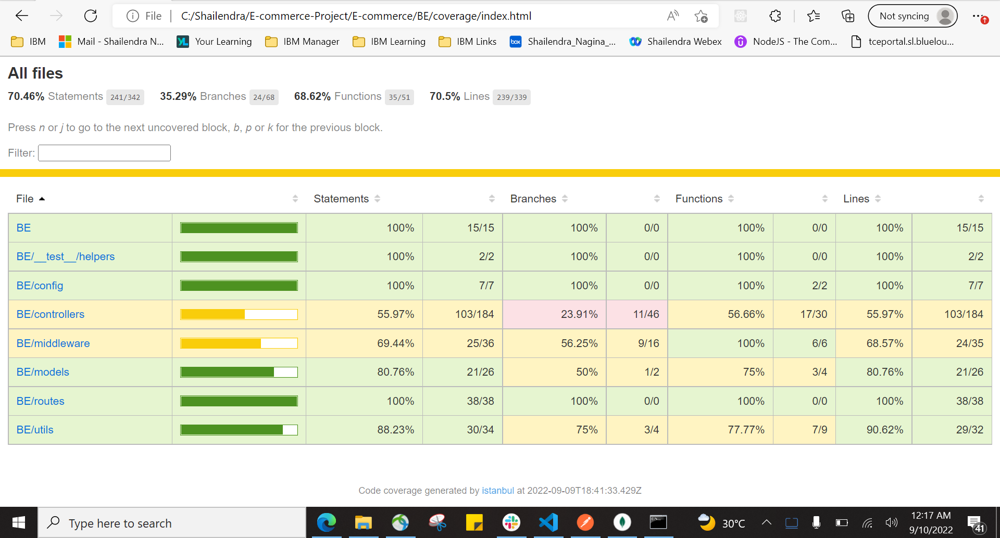

<!-- GETTING STARTED -->
## Getting Started

This is an sample project of how you can create node server and start writing your first REST APi's.

### Prerequisites

install node
### Installation


1. Clone the repo
   ```sh
   git@github.ibm.com:Shailendra-Nagina/E-commerce.git
   ```
2. Install NPM packages
   ```sh
   npm install
   ```
3. run the Backend server
   ```sh
   cd /BE
   npm run dev
   ```

<!-- Test Cases -->

1. run test cases
   ```sh
   cd /BE
   npm run test
 
<!-- USAGE EXAMPLES -->
## Initial coverage(10/09/2022)



## Usage

The best use of this project to run 

<!-- ROADMAP -->
## Roadmap

- [ ] Add Frontenend
- [ ] deploy into aws 


<!-- CONTRIBUTING -->
## Contributing

Contributions are what make the open source community such an amazing place to learn, inspire, and create. Any contributions you make are **greatly appreciated**.

If you have a suggestion that would make this better, please fork the repo and create a pull request. You can also simply open an issue with the tag "enhancement".
Don't forget to give the project a star! Thanks again!

1. Fork the Project
2. Create your Feature Branch (`git checkout -b feature/AmazingFeature`)
3. Commit your Changes (`git commit -m 'Add some AmazingFeature'`)
4. Push to the Branch (`git push origin feature/AmazingFeature`)
5. Open a Pull Request

<p align="right">(<a href="#readme-top">back to top</a>)</p>


<!-- LICENSE -->
## License

Distributed under the MIT License. See `LICENSE.txt` for more information.

<p align="right">(<a href="#readme-top">back to top</a>)</p>


<!-- CONTACT -->
## Contact

Your Name - [Shailendra Nagina] - (https://w3.ibm.com/#/people/002M3W744) - shailendra.nagina@ibm.com

Project Link: [https://github.ibm.com/Shailendra-Nagina/E-commerce](https://github.ibm.com/Shailendra-Nagina/E-commerce)

<p align="right">(<a href="#readme-top">back to top</a>)</p>


<!-- ACKNOWLEDGMENTS -->
## Acknowledgments

Use this space to list resources you find helpful and would like to give credit to. I've included a few of my favorites to kick things off!

* [Reviewer 1](https://w3.ibm.com/#/people/775540744)
* [Reviewer 2](https://w3.ibm.com/#/people/0011P4744)
* [Jest](https://jestjs.io/docs/configuration)
* [NodeJS](https://nodejs.org/docs/latest-v17.x/api/)
* [Express]](https://expressjs.com/))

<p align="right">(<a href="#readme-top">back to top</a>)</p>

